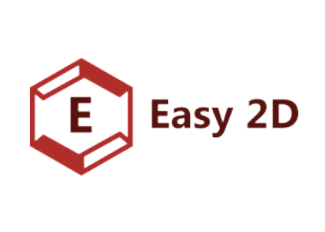

<!--
*** Thanks for checking out the Best-README-Template. If you have a suggestion
*** that would make this better, please fork the repo and create a pull request
*** or simply open an issue with the tag "enhancement".
*** Thanks again! Now go create something AMAZING! :D
-->


<!-- PROJECT SHIELDS -->
<!--
*** I'm using markdown "reference style" links for readability.
*** Reference links are enclosed in brackets [ ] instead of parentheses ( ).
*** See the bottom of this document for the declaration of the reference variables
*** for contributors-url, forks-url, etc. This is an optional, concise syntax you may use.
*** https://www.markdownguide.org/basic-syntax/#reference-style-links
-->
[![Contributors][contributors-shield]][contributors-url]
[![Forks][forks-shield]][forks-url]
[![Stargazers][stars-shield]][stars-url]
[![Issues][issues-shield]][issues-url]
[![MIT License][license-shield]][license-url]
[![LinkedIn][linkedin-shield]][linkedin-url]


<!-- PROJECT LOGO -->
<br />
<p align="center">
  <a href="gallery/logo.png">
    
   </a>
<h3 align="center">Easy 2D</h3>
  <p align="center">
    A simple but robust 2D game engine/API aimed to create simple 2D games.
    <br />
    <a href="https://github.com/ehurturk/Easy2D"><strong>Explore the docs »</strong></a>
    <br />
    <br />
    <a href="https://github.com/ehurturk/Easy2D">View Demo</a>
    ·
    <a href="https://github.com/ehurturk/Easy2D/issues">Report Bug</a>
    ·
    <a href="https://github.com/ehurturk/Easy2D/issues">Request Feature</a>
  </p>
</p>


<!-- TABLE OF CONTENTS -->
<details open="open">
  <summary>Table of Contents</summary>
  <ol>
    <li>
      <a href="#about-the-project">About The Project</a>
      <ul>
        <li><a href="#built-with">Built With</a></li>
      </ul>
    </li>
    <li>
      <a href="#getting-started">Getting Started</a>
      <ul>
        <li><a href="#prerequisites">Prerequisites</a></li>
        <li><a href="#installation">Installation</a></li>
      </ul>
    </li>
    <li><a href="#usage">Usage</a></li>
    <li><a href="#roadmap">Roadmap</a></li>
    <li><a href="#contributing">Contributing</a></li>
    <li><a href="#license">License</a></li>
    <li><a href="#contact">Contact</a></li>
    <li><a href="#acknowledgements">Acknowledgements</a></li>
  </ol>
</details>


<!-- ABOUT THE PROJECT -->
## About The Project


This engine was initially oriented on a simple game that me and my father decided to make: **Tank Wars**. Frankly, I wanted to create a more of like an engine that simplifies the process of creating various types games, instead of focusing on a single game. That's why I have started the **Easy 2D** project - in which I improve my *C* and *OpenGL* knowledge with creating a useful software that creates things I love. Also note that this Engine (though as of now it really is an API/Wrapper of *OpenGL*) is **only** focused on 2D rendering, however after this project I *may* implement *Easy3D* which focuses on 3D rendering.

Also, you *may* find the code obscure/not professional - since I develop the library as I learn (on the fly). If you do, please send me an email (emirhurturk444@gmail.com) and I would be happy to alter the code according to your observation.

A note: Since the engine is currently under development, the codebase lacks quality at some parts, however I aim to refactor this whole engine once I get things up going on and working.

### Built With

* [OpenGL 4.3](https://www.opengl.org) - the [GLAD](https://glad.dav1d.de/) loader
* [GLFW](https://www.glfw.org) - Window & Input handler
* [stb](https://github.com/nothings/stb) - Image Parsing
* [cglm](https://github.com/recp/cglm) - Math library


<!-- GETTING STARTED -->
## Getting Started

To get this engine locally, there are 2 options for you: 1) build & install from the source (**recommended**), 2) download the prebuilt binaries for your platform (as of now the engine supports UNIX machines). All the dependencies of the engine are already in the repo, so no need to download any external library locally (although cmake must be installed if you are planning to build from the source). Here are some simple steps to get this engine up and running locally on your system.
### Prerequisites

* [CMake](https://cmake.org/) (If you are planning to build from the source)

### Installation

#### Building & Installing from source
1. Clone the repo
   ```sh
   git clone https://github.com/ehurturk/Easy2D.git
   ```
2. Create the build directory
   ```sh
   mkdir -p ./build
   ```
3. Generate the build files
   ```sh
   cd build && cmake ..
   ```
4. Compile the project
    ```shell
    make # if a problem happens, try adding sudo (ex: sudo make)
    ```
5. Install the library to your system
    ```shell
    sudo make install # you can change where to install the library by editing the Makefile
    ```
#### Downloading the prebuilt binaries for your platform
Here is the [download](https://github.com/ehurturk/Easy2D.git) link to download the correct binaries without building from the source code.
To be able to successfully install Easy2D to your system, just move the downloaded library file (`libEasy2D.dylib` for mac) to `/usr/local/lib`, and the whole `include` folder to `/usr/local/include`.


<!-- USAGE EXAMPLES -->
## Usage

### Including the library into your project
Although the library is made using the C programming language, it can be used within C++ projects as well. After you have completed the [installation](#installation) process, the necessary _dynamic library_ would be placed under `/usr/local/lib` directory, whereas the necessary _include files_ would be placed under `/usr/local/include` directory. 

 - **Using a package manager like `CMake`**:

   I recommend using cmake as the build file generator which  simplifies the entire process. 
   For projects using CMake, here is a simple `CMakeLists.txt` file to get you started with Easy2D:
   ```cmake
   # CMakeListst.txt, placed inside the root directory of the project.
   cmake_minimum_required(VERSION 3.19)
   project(PROJECT_NAME)

   set(CMAKE_CXX_STANDARD 17) # for C++17 standard
   set(CMAKE_C_STANDARD 99) # for C99 standard

   find_library(Easy2DLIB libEasy2D.1.0.dylib) # locate the dynamic library file inside /usr/local/lib/
   message(STATUS ${EASY2D_LIB}) # output the path of the lib to see if cmake found the file or not

   include_directories(/usr/local/include) # since the Easy2D include files are placed under /usr/local/include, you need to include this inside cmake to be able to access the header files
   add_executable(PROJECT_NAME main.cpp)
   target_link_libraries(${CMAKE_PROJECT_NAME} PUBLIC ${Easy2DLIB})
   ```
- **Using a simple `Makefile`**:
   ```makefile
   LIB=-L/usr/local/lib # the lib location
   INC=-I/usr/local/include # the include direction
   CC = g++ # the g++ compiler
   CFLAGS = -Wall # enable all warnings
  
   default:    main

   main: 
       $(CC) $(CFLAGS) $(INC) main.cpp -o main

   clean:
       rm -r test.o make.out
   ```
  
### Example demonstrating a simple sprite being rendered
Here is a boilerplate code that makes use of Easy2D which renders a white rectangle in the middle of the screen:
```c
#include <Easy2D/easy2d.h> /* the public header file (note: use angled brackets (<>) */

#define EZ_DEBUG_ENABLED

void init();
void update();
void destroy();

EZApplication *app; /* the main application */
EZScene *scene; /* the scene containing all gameobjects, camera, etc. */

int main() {
    app = ezCreateApplication();
    /* After creating the application, you need to register it to Easy2D */
    ezRegisterAsApplication(app);
    /* Then bind the functions */
    ezBindAppInitCallback(init);
    ezBindAppUpdateCallback(update);
    ezBindAppDestroyCallback(destroy);
    
    ezStart(); /* start Easy2D application */

    return 0;
}


void init() {
    app->window   = ezCreateWindow("Easy2DSandbox", 800, 600);
    scene         = ezCreateScene();
    EZCamera *cam = ezCreateCamera(EZ_ORTHOGRAPHIC);
    ezAddToScene(scene, (void *)cam, EZ_CAMERA);

    /* Create a sprite with default shader which implements proj and model matrices by default */
    EZSprite *sprite = ezSquareSprite();

    // Alternatively, you can bind your own shaders / textures the sprite using:

    // EZShader *shader      = ezDirectShaderPipeline(2, 
    //                                (EZShaderInfo){.type = EZ_VERTEX_SHADER, .src = "../res/simple.vs"},
    //                                (EZShaderInfo{.type = EZ_FRAGMENT_SHADER, .src = "../res/simple.fs"}));
    // ezSetSpriteShader(sprite, shader);

    // EZTexture *tex1 = ezLoadTexture("../res/barack.jpeg");
    // ezSetSpriteTexture(sprite, tex1); */

    /* Add the sprite to the scene */
    ezAddToScene(scene, (void *)sprite, EZ_GAMEOBJECT);
}

void update() {
    /* The main loop */
    while (!ezIsWindowOpen(app->window)) {
        /* Renderer stuff */
        ezSetBackgroundColor(0.0f, 0.0f, 0.0f, 1.0f);
        ezClearFrame();
        
        /* Render the current scene */
        ezRenderScene(scene);
        ezUpdateWindow(app->window);
    }
}

void destroy() { 
    /* The cleanup method basically */
    ezFreeApp(app); /* deallocate the app */
    ezDestroyScene(scene); /* deallocate all the objects the scene includes, and their dependent objects */
}

```

_For more examples, please refer to the [Documentation](https://github.com/ehurturk/Easy2D) or the [Sandbox Repository](https://github.com/ehurturk/Easy2DSandbox)_.

## Supported Platforms
The engine currently supports UNIX machines since it uses dll 

<!-- ROADMAP -->
## Roadmap

See the [open issues](https://github.com/ehurturk/Easy2D/issues) for a list of proposed features (and known issues).


<!-- CONTRIBUTING -->
## Contributing

Contributions are what make the open source community such an amazing place to be learn, inspire, and create. Any contributions you make are **greatly appreciated**.

1. Fork the Project
2. Create your Feature Branch (`git checkout -b feature/AmazingFeature`)
3. Commit your Changes (`git commit -m 'Add some AmazingFeature'`)
4. Push to the Branch (`git push origin feature/AmazingFeature`)
5. Open a Pull Request


<!-- LICENSE -->
## License

Distributed under the MIT License. See `LICENSE` for more information.


<!-- CONTACT -->
## Contact

Emir Hurturk - emirhurturk444@gmail.com

Project Link: [https://github.com/ehurturk/Easy2D](https://github.com/ehurturk/Easy2D)


<!-- MARKDOWN LINKS & IMAGES -->
<!-- https://www.markdownguide.org/basic-syntax/#reference-style-links -->
[contributors-shield]: https://img.shields.io/github/contributors/ehurturk/Easy2D.svg?style=for-the-badge
[contributors-url]: https://github.com/ehurturk/Easy2D/graphs/contributors
[forks-shield]: https://img.shields.io/github/forks/ehurturk/Easy2D.svg?style=for-the-badge
[forks-url]: https://github.com/ehurturk/Easy2D/network/members
[stars-shield]: https://img.shields.io/github/stars/ehurturk/Easy2D.svg?style=for-the-badge
[stars-url]: https://github.com/ehurturk/Easy2D/stargazers
[issues-shield]: https://img.shields.io/github/issues/ehurturk/Easy2D.svg?style=for-the-badge
[issues-url]: https://github.com/ehurturk/Easy2D/issues
[license-shield]: https://img.shields.io/github/license/ehurturk/Easy2D.svg?style=for-the-badge
[license-url]: https://github.com/ehurturk/Easy2D/blob/master/LICENSE.txt
[linkedin-shield]: https://img.shields.io/badge/-LinkedIn-black.svg?style=for-the-badge&logo=linkedin&colorB=555
[linkedin-url]: https://www.linkedin.com/in/emir-h%C3%BCrt%C3%BCrk-2724571a3/
[product-screenshot]: images/screenshot.png
